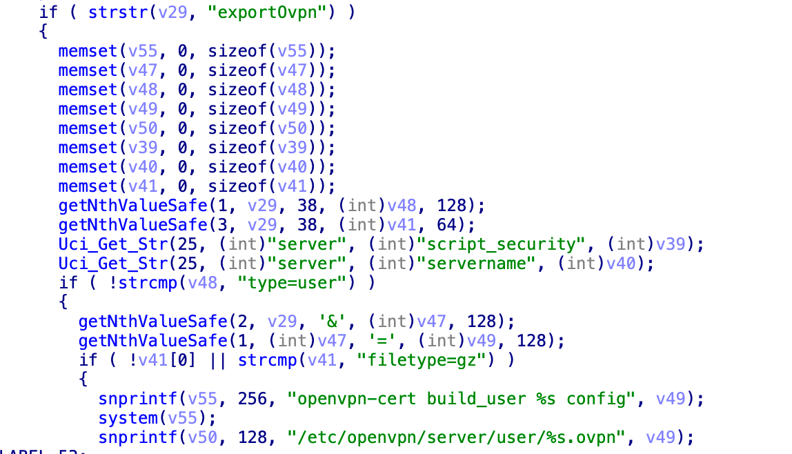
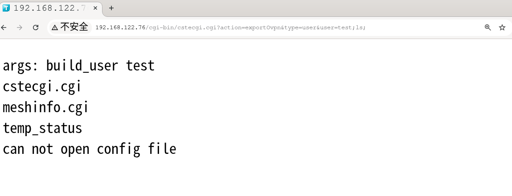
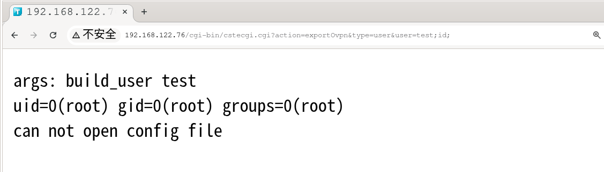

# TOTOLINK_X5000R_V9.1.0cu.2089_B20211224 RCE
## file information

firmware download address https://www.totolink.net/home/menu/detail/menu_listtpl/download/id/218/ids/36.html

## details

A command injection vulnerability exists in the TOTOLINK X5000R wireless router.
The CGI binary cstecgi.cgi contains improper input parsing logic, allowing remote attackers to execute arbitrary commands without authentication by abusing the exportOvpn handler.

The vulnerability is triggered when user-controlled parameters are inserted into a shell command executed via system().

```
payload = /cgi-bin/cstecgi.cgi?action=exportOvpn&type=user&user=test;id;
```

## results



